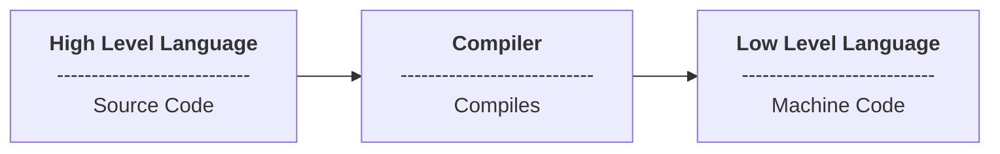

# Build 

Research & development in building source code with build tools:

- compilers/transpilers
- bundlers
- task runners
- dev servers
- linters
- formatters

## What is a compiler?

In computing, a compiler is a computer program that translates computer code written in one programming language (the source language) into another language (the target language). The name "compiler" is primarily used for programs that translate source code from a high-level programming language to a low-level programming language (e.g. assembly language, object code, or machine code) to create an executable program.
It translates and compiles it down to a language that can be understood by the machine.



For an awesome tutorial on compilers, check out [the-super-tiny-compiler](https://github.com/jamiebuilds/the-super-tiny-compiler), which also explains how Babel itself works on a high level.

In summary, basically, a compiler will try to understand what we want to do and will turn our language into usually a low-level language such as machine code.

For example, consider a high-level language like Javascript; an interpreter will read this code line by line and spit out byte code that executes this code for us. Or a compiler might take our code and spit out machine code to give to a CPU so it can run the code.


## Packages

### What is a package?

The npm registry contains packages, many of which are also Node modules, or contain Node modules. Read on to understand how they differ and how they interact.

A **package** is a file or directory that is described by a `package.json` file. A package must contain a `package.json` file in order to be published to the npm registry.  

Packages can be unscoped or scoped to a user or organization, and scoped packages can be private or public. 

For more information, see:

- [NPM - About packages and modules](https://docs.npmjs.com/about-packages-and-modules)
- [Node.js - Packages API](https://nodejs.org/api/packages.html)
- [Node.js - package.json field definitions](https://nodejs.org/docs/latest-v18.x/api/packages.html#nodejs-packagejson-field-definitions)

### About package formats

A package is any of the following:

* a) A folder containing a program described by a `package.json` file.
* b) A gzipped tarball containing (a).
* c) A URL that resolves to (b).
* d) A `<name>@<version>` that is published on the registry with (c).
* e) A `<name>@<tag>` that points to (d).
* f) A `<name>` that has a `latest` tag satisfying (e).
* g) A `git` url that, when cloned, results in (a).

### npm package git URL formats

Git URLs used for npm packages can be formatted in the following ways:

- `git://github.com/user/project.git#commit-ish`
- `git+ssh://user@hostname:project.git#commit-ish`
- `git+http://user@hostname/project/blah.git#commit-ish`
- `git+https://user@hostname/project/blah.git#commit-ish`

The `commit-ish` can be any tag, sha, or branch that can be supplied as
an argument to `git checkout`. The default `commit-ish` is `master`.

### Package entry points

In a package's package.json file, two fields can define entry points for a package: "main" and "exports". Both fields apply to both ES module and CommonJS module entry points.

The "main" field is supported in all versions of Node.js, but its capabilities are limited: it only defines the main entry point of the package.

The "exports" provides a modern alternative to "main" allowing multiple entry points to be defined, conditional entry resolution support between environments, and preventing any other entry points besides those defined in "exports". This encapsulation allows module authors to clearly define the public interface for their package.

For more information, see [Node.js API - Package entrypoint](https://nodejs.org/docs/latest-v18.x/api/packages.html#package-entry-points).

## Modules

### What is a module?

A **module** is any file or directory in the `node_modules` directory that can be loaded by the Node.js `require()` function.

To be loaded by the Node.js `require()` function, a module must be one of the following:

* A folder with a `package.json` file containing a `"main"` field.
* A JavaScript file.

**Note:** Since modules are not required to have a `package.json` file, not all modules are packages. Only modules that have a `package.json` file are also packages.

In the context of a Node program, the `module` is also the thing that
was loaded *from* a file. For example, in the following program:

    var req = require('request')

we might say that "The variable `req` refers to the `request` module".

### Module Bundlers

A module bundler is a tool that takes pieces of JavaScript and their dependencies and bundles them into a single file, usually for use in the browser. You may have used tools such as Browserify, Webpack, Rollup or one of many others.

It usually starts with an entry file, and from there it bundles up all of the code needed for that entry file.

Visit the following resources to learn more:

- [Let’s learn how module bundlers work](https://www.freecodecamp.org/news/lets-learn-how-module-bundlers-work-and-then-write-one-ourselves-b2e3fe6c88ae/)
- [Module Bundlers Explained](https://www.youtube.com/watch?v=5IG4UmULyoA)

### Determining module system
 
Determine module is CommonJS or ESM.
For more information, see [Node.js - Determining module system](https://nodejs.org/docs/latest-v18.x/api/packages.html#determining-module-system).

#### ES Modules

Node.js will treat the following as ES modules when passed to node as the initial input, or when referenced by import statements or import() expressions:

- Files with an .mjs extension.

- Files with a .js extension when the nearest parent package.json file contains a top-level "type" field with a value of "module".

    ```json
    // package.json

    {
        "name": "my package",
        "type": "module",
        // ...
    }
    ```

- Strings passed in as an argument to --eval, or piped to node via STDIN, with the flag --input-type=module.

#### CommonJS

Node.js will treat as CommonJS all other forms of input, such as .js files where the nearest parent package.json file contains no top-level "type" field, or string input without the flag --input-type. This behavior is to preserve backward compatibility. However, now that Node.js supports both CommonJS and ES modules, it is best to be explicit whenever possible. Node.js will treat the following as CommonJS when passed to node as the initial input, or when referenced by import statements, import() expressions, or require() expressions:

- Files with a .cjs extension.

- Files with a .js extension when the nearest parent package.json file contains a top-level field "type" with a value of "commonjs".

- Strings passed in as an argument to --eval or --print, or piped to node via STDIN, with the flag --input-type=commonjs.

Package authors should include the "type" field, even in packages where all sources are CommonJS. Being explicit about the type of the package will future-proof the package in case the default type of Node.js ever changes, and it will also make things easier for build tools and loaders to determine how the files in the package should be interpreted.

## Resources

- [Inside the JavaScript Engine](https://medium.com/@allansendagi/inside-the-javascript-engine-compiler-and-interpreter-c8faa638b0d9)
- [The super tiny compiler](https://github.com/jamiebuilds/the-super-tiny-compiler)
- [Webpack is a static module bundler for modern JavaScript applications](https://webpack.js.org/)
- [Vite Next Generation Frontend Tooling](https://vitejs.dev)
- [Parcel is a zero configuration build tool for the web](https://parceljs.org/)