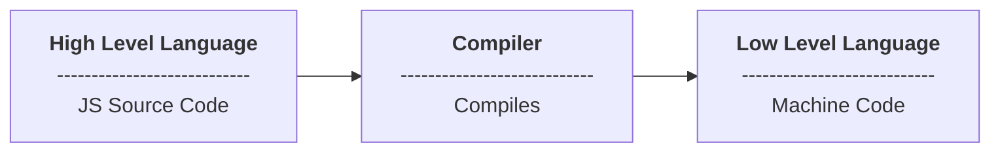

# Babel Typescript Build

## What is a compiler?

In computing, a compiler is a computer program that translates computer code written in one programming language (the source language) into another language (the target language). The name "compiler" is primarily used for programs that translate source code from a high-level programming language to a low-level programming language (e.g. assembly language, object code, or machine code) to create an executable program.
It translates and compiles it down to a language that can be understood by the machine.

For an awesome tutorial on compilers, check out [the-super-tiny-compiler](https://github.com/jamiebuilds/the-super-tiny-compiler), which also explains how Babel itself works on a high level.

In summary, basically, a compiler will try to understand what we want to do and will turn our language into usually a low-level language such as machine code.

For example, consider a high-level language above like Javascript; an interpreter will read this code line by line and spit out byte code that executes this code for us. Or a compiler might take our code and spit out machine code to give to a CPU so it can run the code.



## What is Babel?

Babel is a Javascript compiler. It takes your modern JS source code and returns browser compatible JS (older JS code).
Typescript is a superset of Javascript that compiles down to Javascript.

It's a toolchain that is mainly used to convert ECMAScript 2015+ code into a backwards compatible version of JavaScript in current and older browsers or environments.

Here are the main things Babel can do for you:
- Transform syntax
- Polyfill features that are missing in your target environment (through a third-party polyfill such as core-js)
- Source code transformations (codemods)

## Understanding the need for Babel

Babel is a popular tool that is mainly used to convert ECMAScript 2015+ code into a backward-compatible version of JavaScript in current and older browsers or environments. It can also convert TypeScript code into JavaScript.

### Why would you use Babel to transpile TypeScript when the TypeScript compiler already does this?

Babel is capable of converting JSX to JavaScript - the TypeScript compiler can't do this.** 

So, if your project is built using React, you will need Babel. If a project already uses Babel, it is simpler for that to take full responsibility for all the transpilation. That leaves TypeScript to focus on what it is best at - type checking.

**In summary, if transpilation requirements are beyond the TypeScript compiler's scope, we can use Babel for transpilation and TypeScript for type checking.**

### What is Babel

Babel is a tool to help us transpile newer versions of JavaScript code such as ES6 into older versions of JavaScript — it even helps you transpile TypeScript.

Babel reads the source code based on the configs you define for it and compiles newer JavaScript features such as arrow functions or optional chaining. This happens with Babel’s three major tools:

- First, Babel’s parser takes the JavaScript code and converts it to an Abstract Syntax Tree (AST) which is the structure of the source code understandable by the computer

- Next, Babel’s traverser takes the AST, explores it and modify it to the intended code we defined in our Babel configs

- Lastly, Babel’s generator will translate the modified AST back to the regular code


## Babel vs TypeScript

When making a modern JavaScript project, you might ask yourself what is the right way to convert files from TypeScript to JavaScript?

A lot of the time the answer is “it depends”, or “someone may have decided for you” depending on the project. If you are building your project with an existing framework like tsdx, Angular, NestJS or any framework mentioned in the Getting Started then this decision is handled for you.

However, a useful heuristic could be:

1. Is your **build output** mostly the same as your source input files? Use tsc
2. Do you need a **build pipeline** with multiple potential outputs? Use babel for transpiling and tsc for type checking

## Notes

- Babel is a Javascript compiler that takes your modern JS code and returns browser compatible JS (older JS code).

- Typescript is a superset of Javascript that compiles down to Javascript.

- What are some changes we need to make in `tsconfig.json` to stop TypeScript doing the transpilation? 

    ```json
    "compilerOptions": {
        // Disable emitting files from a compilation. 
        // "noEmit": true,

        // Generate .d.ts files from TypeScript and JavaScript files in your project.
        "declaration": true,

        // Only output d.ts files and not JavaScript files
        "emitDeclarationOnly": true,

        // Ensure that Babel can safely transpile files in the TypeScript project
        "isolatedModules": true
    }
    ```